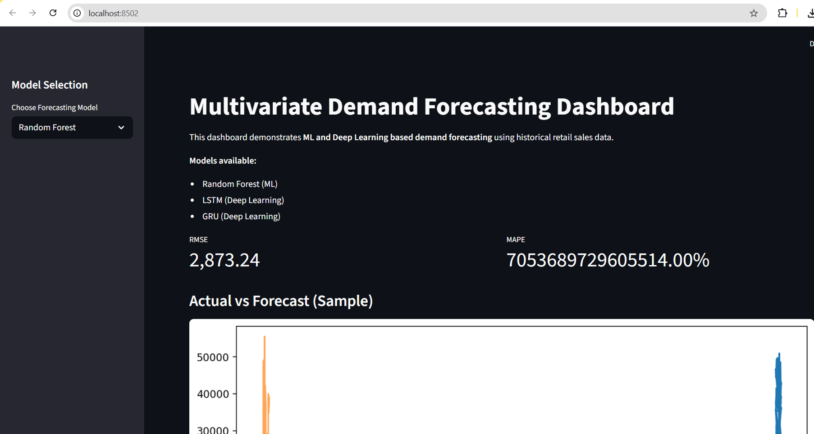

# Multivariate Time-Series Demand Forecasting (ML + LSTM/GRU)

## 📌 Overview
This project implements an **end-to-end multivariate time-series forecasting pipeline**
to predict retail demand using **classical Machine Learning and Deep Learning models**.
The solution focuses on learning temporal patterns and translating forecasts into
**actionable inventory risk insights**.

The project follows **industry-standard data science workflows** and includes
a **deployable Streamlit dashboard** for interactive analysis.

---

## 🧠 Problem Statement
Retail demand is influenced by seasonality, holidays, store characteristics,
and external economic factors. Traditional forecasting approaches often fail
to capture these complex temporal dependencies, leading to stock-outs or overstocking.

This project addresses the problem by:
- Modeling demand as a **multivariate time series**
- Comparing **ML baselines vs Deep Learning sequence models**
- Converting forecasts into **business-ready risk signals**

---

## 📊 Dataset
- **Walmart Store Sales Forecasting Dataset (Kaggle)**
- Weekly sales data with:
  - Store & department information
  - Holiday indicators
  - External economic variables (CPI, fuel price, unemployment)

> Note: Large datasets are excluded from version control and are expected to be
> downloaded separately for reproduction.

---

## 🧪 Modeling Approach
### Machine Learning
- Linear Regression (baseline)
- Random Forest Regressor

### Deep Learning
- LSTM (Long Short-Term Memory)
- GRU (Gated Recurrent Unit)

**Key practices followed:**
- Time-aware train–test split
- Lag & rolling feature engineering
- RMSE and MAPE for evaluation
- ML → DL progression for justified complexity

---

## 📈 Key Results
- Deep learning models outperform classical ML baselines
- GRU provides comparable or better performance with lower complexity
- Forecast errors are translated into:
  - **Stock-out risk**
  - **Overstock risk**

---

## 🖥️ Streamlit Dashboard
The project includes an interactive **Streamlit dashboard** that allows:
- Model selection (RF / LSTM / GRU)
- Actual vs forecast visualization
- RMSE & MAPE comparison
- Inventory risk distribution

### 📸 Dashboard Preview


---

## 🚀 How to Reproduce Results

### 1️⃣ Clone Repository
```bash
git clone https://github.com/konda-eassai/multivariate-time-series-demand-forecasting.git
cd multivariate-time-series-demand-forecasting
